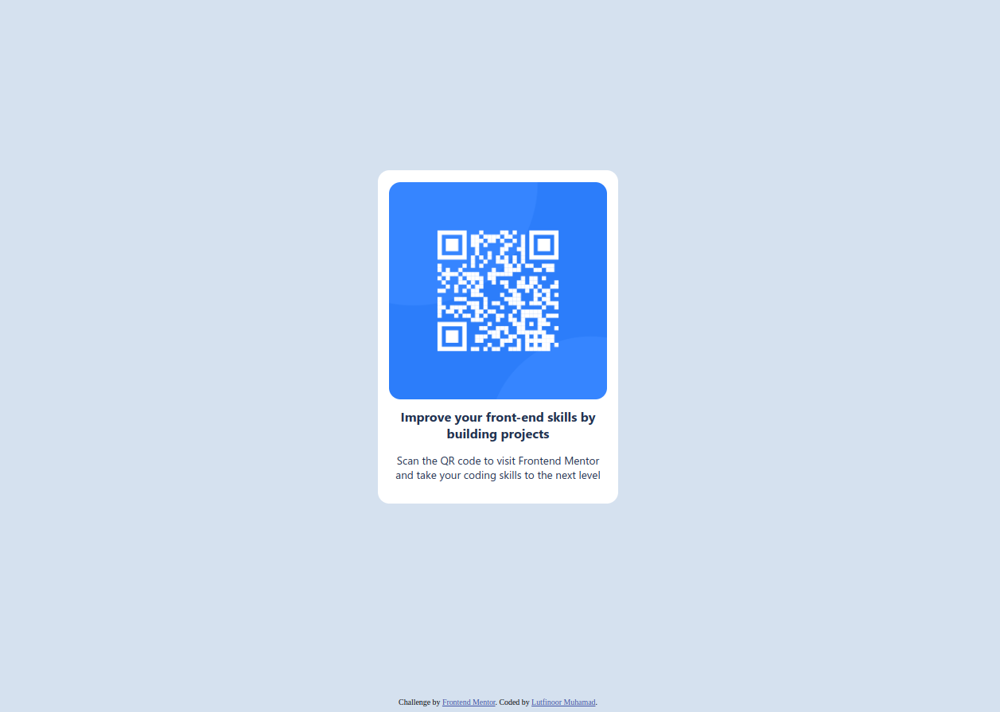

# Frontend Mentor - QR code component solution

This is a solution to the [QR code component challenge on Frontend Mentor](https://www.frontendmentor.io/challenges/qr-code-component-iux_sIO_H). Frontend Mentor challenges help us improve coding skills by building realistic projects. 

## Table of contents

- [Overview](#overview)
  - [Screenshot](#screenshot)
  - [Links](#links)
- [My process](#my-process)
  - [Built with](#built-with)
  - [What I learned](#what-i-learned)
  - [Continued development](#continued-development)
  - [Useful resources](#useful-resources)
- [Author](#author)
- [Acknowledgments](#acknowledgments)


## Overview

### Screenshot



Desktop Version

### Links

- Solution URL: [Solution URL](https://github.com/lutfinoorm/frontend-mentor-qr-component-solution)
- Live Site URL: [Live site URL](https://lutfinoorm.github.io/frontend-mentor-qr-component-solution/)

## My process

### Built with

- Semantic HTML5 markup
- CSS custom properties
- Flexbox
- CSS Grid

### What I learned

I learned how to make element in the center of the page. Clearly I'm not expert on it. But I'll try to improve by leaving this css rule here.

```css
html, body {
  background-color: rgba(213,225,239,255);
  display: flex;
  flex-direction: column;
  justify-content: center;
  align-items: center;
  height: 100%;
}

div {
  text-align: center;
}

img {
  max-width: 100%;  /* Ensures the image will never be wider than the div */
  height: auto;     /* Maintains the aspect ratio of the image */
  display: block;   /* Removes any extra space under the image */
  margin: 0 auto;
  border-radius: 16px;  
}
```


### Continued development

I need more depth understanding about making element centered in the page and how to make a responsive page.


### Useful resources

- [Shecodes](https://www.shecodes.io/athena/9307-how-to-make-a-responsive-page-with-css-and-html#:~:text=Use%20CSS%20Media%20Queries%3A%20The,mobile%20devices%20versus%20desktop%20devices) - This helped me me understand responsive design a little bit.


## Author

- Website - [Lutfinoor](https://www.your-site.com)
- Frontend Mentor - [@lutfinoorm](https://www.frontendmentor.io/profile/lutfinoorm)


## Acknowledgments

I will leave this part here for the future project. 
